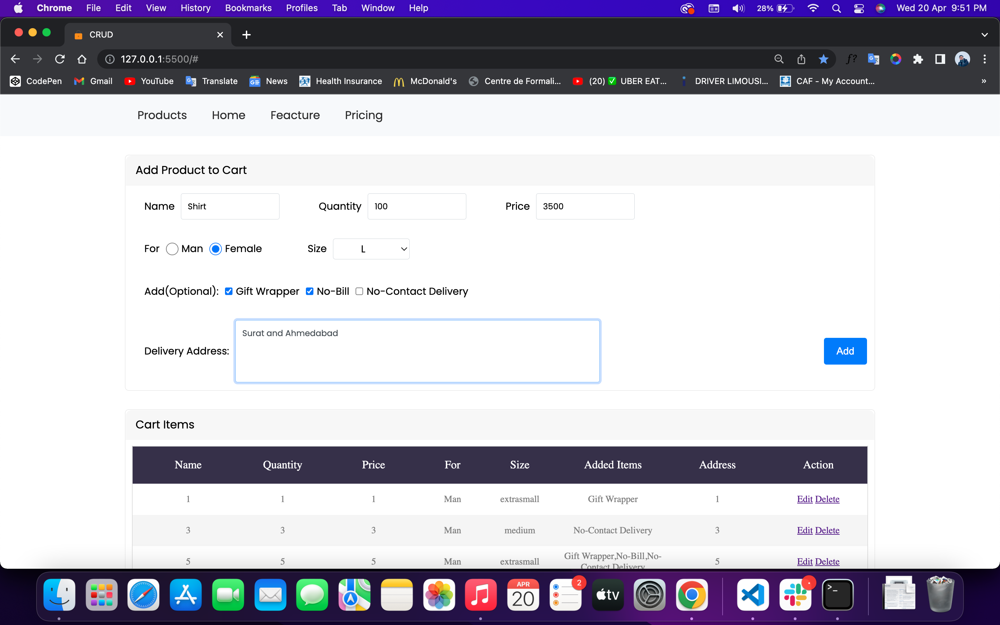
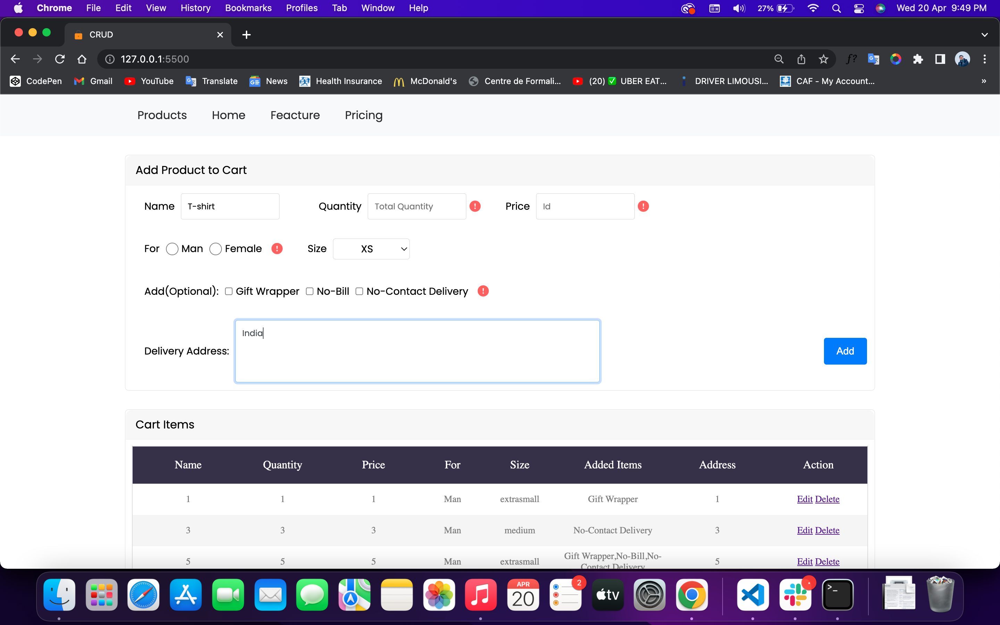

# CRUD

Hello Everyone, It is CRUD Opertion:
Where User can:

```
1. Create
2. Read
3. Update
4. Delete
```
Project is developed using the Pure HTML, CSS, JavaScript.

# User Interface
<br>
<p align="center">
  
</p>
<br>

# User flow
### 1. In the Starting User will fill-up the form and Data will be stored on localstorage:

### 2. On Add data will be add into Table

### 3. On Edit table row data will be refill in form to Edit the Entry.
<br>
<p align="center">
  
</p>
<br>

### Thank You!
For more details Contact me on [LinkedIn](https://www.linkedin.com/in/sagarkumar-limbasiya/)
